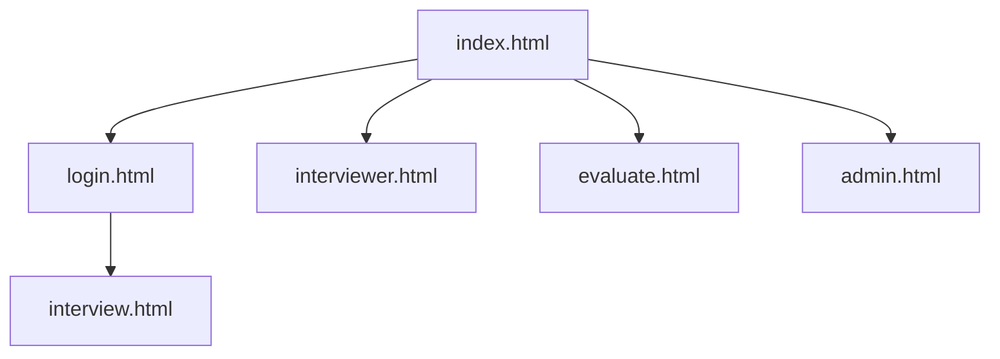
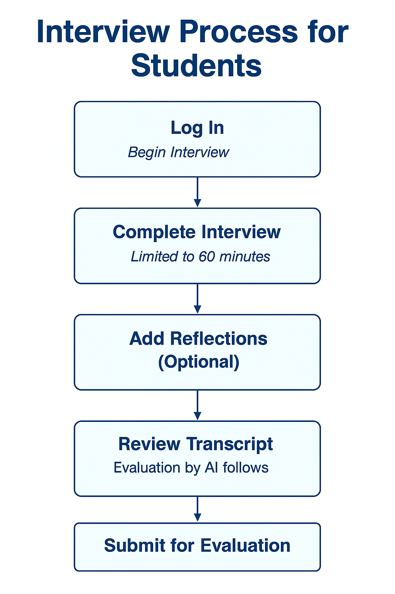
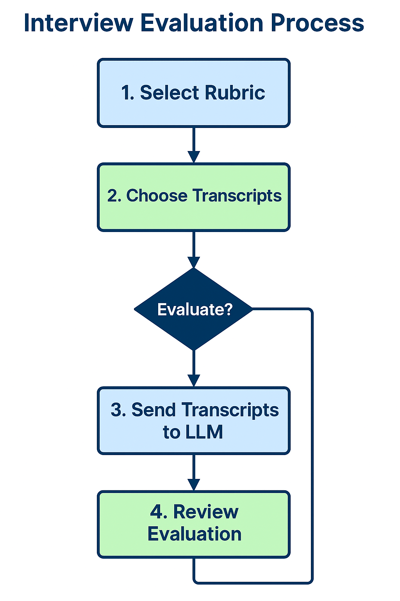
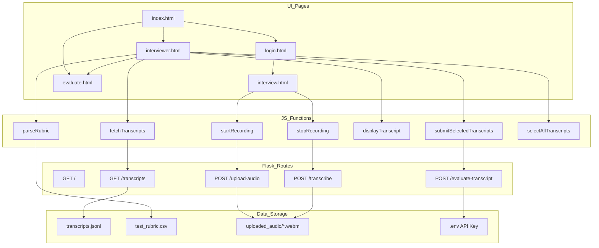

# Summary of Technical Contributions – SkillScope Prototype 2

**Author:** Jeffrey Weekley  
**Role:** Primary Full-stack Developer, Designer, and Technical Implementation Lead  
**Project:** SkillScope Prototype 2 – Full-Stack AI-Powered Interview Evaluation System  
**Duration:** Spring 2025  

---

## Overview

SkillScope is a full-stack web application designed to support asynchronous voice-based interviews with AI-powered evaluation using OpenAI's LLMs. The system provides both student-facing and interviewer-facing workflows, emphasizing accessibility, automation, and pedagogical transparency.

This prototype demonstrates the feasibility of AI-assisted formative assessments for higher education using recorded talk-aloud interviews and rubric-based evaluations.

---

## Technical Contributions

### 1. Interactive Web Application

- Designed and implemented a multi-page web interface using HTML, CSS, and JavaScript.
- Pages include:
  - `index.html`: Entry point and site navigation
  - `login.html`: Entry point for interviewees
  - `interview.html`: Audio recording and transcript preview for students
  - `interviewer.html`: Rubric upload, transcript selection, and evaluation interface
  - `admin.html`: Placeholder for future system admin functionality
- Custom JavaScript modules (`interview.js`, `interviewer.js`, `admin.js`) provide client-side logic.

#### Site Structure Map

---

### 2. Custom Recording and Transcription Pipeline

- Integrated OpenAI Whisper API for client-initiated audio transcription.
- Implemented a countdown timer, transcript preview, and single-submission enforcement for students.
- Audio recordings saved as `.webm` files and paired with metadata in `.json`.
- Created preview and review stages for students to check transcripts before submission.

#### Interviewee Interaction Diagram

#### Component and Event Architecture (graphTD)

---

### 3. Evaluation Workflow for Interviewers

- Implemented multi-transcript selection with dynamic preview panel.
- Built state-tracking system for selected transcripts with toggling, color indicators, and deselection.
- Connected to OpenAI’s Chat API for rubric-based evaluation of multiple transcripts.
- Evaluation results are logged and displayed, with logic to prevent duplicate submissions.

---

### 4. Rubric Integration and Session Management

- Rubrics are uploaded in `.csv` format and stored in Flask `instance/` path.
- The latest rubric persists during session and is included with all evaluations.
- Removed redundant "Submit Rubric" button after implementing auto-preview and in-memory state management.

---

### 5. Flask Server and Secure Routing

- Built a robust Flask backend with routes for:
  - `/upload`, `/submit-transcript`, `/transcripts`, `/evaluate-transcript`, etc.
- All audio and transcript files stored securely in `/instance/` and `/uploaded_audio/`.
- Used secure filenames, exception handling, and status code responses.
- `.env` file stores OpenAI API key and system secrets.

---

### 6. Evaluation Logic and LLM Assessment Module

- Authored `llm_assess_interviews.py` to modularize the LLM evaluation logic.
- Receives transcript and rubric, formulates structured GPT-4 prompt, and parses the returned assessment.
- Supports multiple performance dimensions and categorical output parsing.

---

### 7. Process Mapping and Accessibility Design

- Defined interviewer and interviewee flows using accessibility-informed principles.
- Ensured contrast ratios, font sizing, and semantic HTML for W3C compliance.
- Used Mermaid and visual diagrams for planning and documentation.

---

## Future Work

- Admin panel to manage transcripts, users, and evaluation tracking.
- Integration of persistent session and identity tracking.
- User-specific history, rollback support, and rubric versioning.

---
